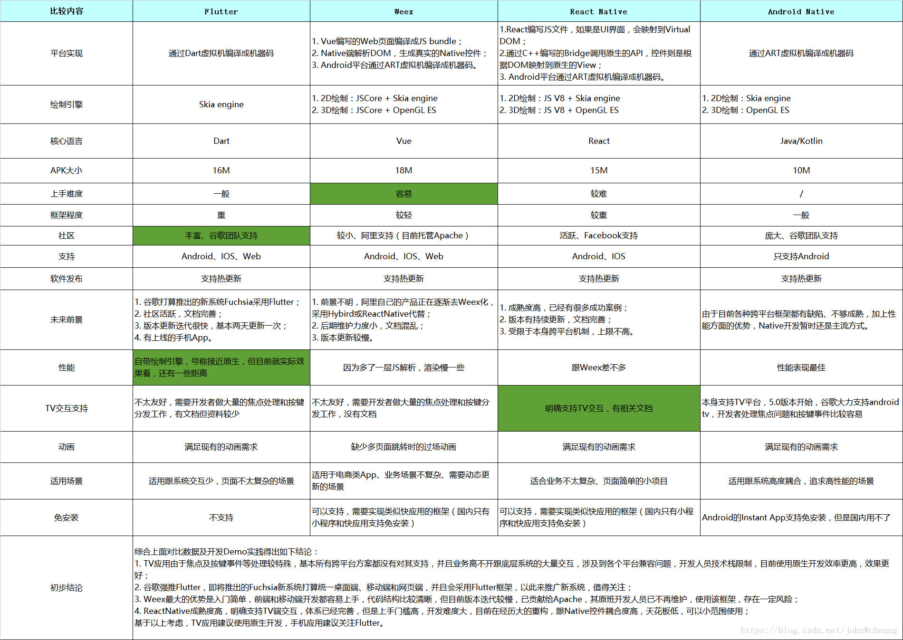

# React Native

在 React Native 出现前，我们通常会选择这三种移动技术（Native App、HTML5、Hybrid）之⼀进⾏ 开发。

Native App ：开发原⽣应⽤⾃然性能最好，功能强⼤。但多平台版本的开发、维护要花费⼤量的⼈⼒物⼒(iOS 版本迭代审核需要时间)。

HTML5：虽然有 Web 的优势，即灵活的布局能⼒、免发版的敏捷迭代潜⼒、优秀的跨平台特性。在新闻资讯等⼀些强排版、弱交互的展示类 App 上⼤展拳脚。但由于 WebView 在移动设备上的性能制约，始终难成⼤器。

HybridApp：JS+Native 两者相互调⽤为主，从开发层⾯实现“⼀次开发，多处运⾏”的机制，成为真正适合跨平台的开发。HybridApp 兼具了 NativeApp 良好⽤户体验的优势，也兼具了 WebApp 使⽤ HTML5 跨平台开发低成本的优势，但是这个⽅法存在诸多问题：**⽆法访问离线数据、⽆法访 问设备、⽆法远程更新**。

React Native ：底层引擎是 JavaScript Core，但调⽤的是原⽣的组件⽽⾮ HTML5 组件。这样 运⾏时可以做到与 Navive App 相媲美的性能体验，同时因为 JavaScript 代码可以使⽤后端强⼤的 Web ⽅式管理，既可以做到⾼效开发，也可以实现快速部署和问题热修复。

## RN Pro and Con

优点

1. 跨平台开发：运⽤ React Native，我们可以使⽤同⼀份业务逻辑核⼼代码来创建原⽣应⽤运⾏在 Web 端，Android 端和 iOS 端
2. 追求极致的⽤户体验：实时热部署
3. learn once, write everywhere. React Native 不强求⼀份原⽣代码⽀持多个平台，所以不是 write once, run anywhere

缺点

1. 开发成本较⾼
2. 部分复杂的界⾯和操作，RN ⽆法实现(可以考虑原⽣+React Native 混合开发)；

## RN, Flutter, Weex



## RN debug

|                               | Android       | IOS           |
| ----------------------------- | ------------- | ------------- |
| 在模拟器上开启 Developer Menu | `Command + M` | `Command + D` |
| Reload                        | double R      | `Command + R` |

Chrome Developer Tools: 在 Developer Menu 下单击”Debug JS Remotely” 启动 JS 远程调试功能。此时 Chrome 会被打开，同时会创建⼀个 <http://localhost:8081/debugger-ui> Tab ⻚。这样就可以打开 chrome 开发者工具打断点

## RN layout and style

### RN difference with web flexbox

RN 中的布局⽅式采⽤的是 FlexBox(弹性布局)，**和 web 主轴默认方向不一致～！**

- flexDirection:（主轴⽅向）: RN 中默认是 flexDirection:'column', Web Css 中默认是 flex-direction:'row'
- alignItems:（在交叉轴上的对⻬⽅式）: RN 中默认 alignItems: 'stretch', 在 Web Css 中默认 align-items:'flex-start'
- flex: RN 中只接受⼀个属性，Web css 可以接受多个属性：flex: 2 2 10%
- 不⽀持的属性： align-content flex-basis order flex-flow flex-grow flex-shrink

> 以下属性是 RN 所⽀持的 Flex 属性
>
> - 容器属性:
>
>   - flexDirection: row | column| row-reverse | column-reverse
>   - flexWrap: wrap | noWrap
>   - justifyContent: flex-start | flex-end | center | space-between | space-around
>   - alignItems: flex-start | flex-end | center | stretch
>
> - 项⽬属性:
>
>   - alignSelf stretch center flex-start flex-end
>
> - flex: 定义了⼀个元素可伸缩的能⼒，默认是 0

### RN pixel

在 RN 中尺⼨是没有单位的，它代表的是设备独⽴像素

```jsx
<View style={{width: 100, height: 100, margin: 10, backgroundColor: 'gray'}}>
  <Text style={{fontSize: 16, margin: 20}}>尺⼨</Text>
</View>
```

上述代码，运⾏在 Android 上时，View 的⻓宽被解释成：100dp 100dp，字体被解释成 16sp，运⾏在 ios 上时尺⼨单位被解释成 pt,这些单位确保了布局在任何不通 DPI 的⼿机屏幕上，显示效果⼀致

### 样式

在 RN 中样式 需要引⼊ StyleSheet API

```jsx
<View style={styles.container}></View>

const styles = StyleSheet.create({
  container: {},
});

<View style={{backgroundColor: 'red'}}></View>
<View style={[styles.container, {backgroundColor: 'red'}]}></View>
```

## Common Components

### Button

```jsx
<Button
  onPress={onPressLearnMore} //⽤户点击此按钮时所调⽤的处理函数
  title="Learn More" //按钮按钮内显示的⽂本
  color="#841584" //⽂本的颜⾊(iOS)，或是按钮的背景⾊(Android)
  disabled={false} //按钮是否可以点击
  accessibilityLabel="Learn more about this purple button" //⽤于给残障⼈⼠显示的 ⽂本（⽐如读屏应⽤可能会读取这⼀内容
>
  Button
</Button>
```

### ActivityIndicator：显示⼀个圆形的 loading 提示符号。

```jsx
<View style={[styles.container, styles.horizontal]}>
  <ActivityIndicator
    size="large" //指示器的⼤⼩，默认为'small'[enum('small', 'large'), number]。⽬前只能在 Android 上设定具体的数值
    animating={true} //是否要显示指示器动画，默认为 true 表示显示，false 则隐藏。
    hidesWhenStopped={false} //在animating为 false 的时候，是否要隐藏指示器（默认为 true）。如果animating和hidesWhenStopped都为 false，则显示⼀个静⽌的指示器。
    color="#0000ff" //滚轮的前景颜⾊（默认为灰⾊）。
  />
</View>
```

### Image

```jsx
<Image source={require('/react-native/img/favicon.png')} />

<Image style={{width: 50, height: 50}}
//⽹络和 base64 数据的图⽚需要⼿动指定尺⼨
source={{uri: 'https://facebook.github.io/reactnative/docs/assets/favicon.png'}} />

<Image style={{width: 66, height: 58}}
//⽹络和 base64 数据的图⽚需要⼿动指定尺⼨
source={{uri: 'data:image/png;base64,iVBORw0KGgoAAAANSUhEUgAAADMAAAAzCAYAAAA6oTAqAAAAEXRFWHR Tb2Z0d2FyZQBwbmdjcnVzaEB1SfMAAABQSURBVGje7dSxCQBACARB+2/ab8BEeQNhFi6WSYzYLYudD QYGBgYGBgYGBgYGBgYGBgZmcvDqYGBgmhivGQYGBgYGBgYGBgYGBgYGBgbmQw+P/eMrC5UTVAAAAAB JRU5ErkJggg=='}} />
```

在 Android 上⽀持 GIF 和 WebP 格式图⽚

默认情况下 Android 是不⽀持 GIF 和 WebP 格式的。你需要在 `android/app/build.gradle` ⽂件中根据需要⼿动添加以下模块：

```gradle
dependencies {
  // 如果你需要⽀持Android4.0(API level 14)之前的版本
  compile 'com.facebook.fresco:animated-base-support:1.10.0'

  // 如果你需要⽀持GIF动图
  compile 'com.facebook.fresco:animated-gif:1.10.0'

  // 如果你需要⽀持WebP格式，包括WebP动图
  compile 'com.facebook.fresco:animated-webp:1.10.0'
  compile 'com.facebook.fresco:webpsupport:1.10.0'

  // 如果只需要⽀持WebP格式⽽不需要动图
  compile 'com.facebook.fresco:webpsupport:1.10.0'
}
```

### SafeAreaView

SafeAreaView 的⽬的是在⼀个“安全”的可视区域内渲染内容。具体来说就是因为⽬前有 iPhone X 这样的带有“刘海”的全⾯屏设备，所以需要避免内容渲染到不可⻅的“刘海”范围内。本组件⽬前仅⽀持 iOS 设备以及 iOS 11 或更⾼版本。

SafeAreaView 会⾃动根据系统的各种导航栏、⼯具栏等预留出空间来渲染内部内容。更重要的是，它还会考虑到设备屏幕的局限，⽐如屏幕四周的圆⻆或是顶部中间不可显示的“刘海”区域。

### Text

⼀个⽤于显示⽂本的 React 组件，并且它也⽀持嵌套、样式，以及触摸处理，在 Text 内部的元素不再使⽤ flexbox 布局，⽽是采⽤⽂本布局。这意味着 `<Text>` 内部的元素不再是⼀个个矩形，⽽可能会在⾏末进⾏折叠

```jsx
<Text
  ellipsizeMode={'tail'} //这个属性通常和下⾯的 numberOfLines 属性配合使⽤,⽂本超出 numberOfLines设定的⾏数时，截取⽅式：head- 从⽂本内容头部截取显示省略号。例如： "...efg"，middle - 在⽂本内容中间截取显示省略号。例如： "ab...yz"，tail - 从⽂本内容尾 部截取显示省略号。例如： "abcd..."，clip - 不显示省略号，直接从尾部截断。
  numberOfLines={1} //配合ellipsizeMode设置⾏数
  onPress={} //点击事件
  selectable={true} //决定⽤户是否可以⻓按选择⽂本，以便复制和粘贴。
></Text>
```

### TextInput

是⼀个允许⽤户在应⽤中通过键盘输⼊⽂本的基本组件。本组件的属性提供了多种特性的配置，譬如⾃动完成、⾃动⼤⼩写、占位⽂字，以及多种不同的键盘类型（如纯数字键盘）,TextInput

在安卓上默认有⼀个底边框，同时会有⼀些 padding。如果要想使其看起来和 iOS 上尽量⼀致，则需要设置 padding: 0

```jsx
<TextInput
  style={{width: 100, height: 40, borderWidth: 3, borderColor: 'blue'}}
  keyboardType={'default'} //决定弹出何种软键盘类型，譬如numeric（纯数字键 盘),default,number-pad,decimal-pad,numeric,email-address,phone-pad
  maxLength={20} //限制⽂本框中最多的字符数。使⽤这个属性⽽不⽤JS逻辑去实现，可以避免闪烁 的现象。
  editable={true} //如果为false，⽂本框是不可编辑的。默认值为true。
  defaultValue={'xxxx'} //提供⼀个⽂本框中的初始值
  caretHidden={true} //如果为true，则隐藏光标。默认值为false。
  autoCapitalize={'none'} //控制TextInput是否要⾃动将特定字符切换为⼤写:characters: 所有的字符,words: 每个单词的第⼀个字符,sentences: 每句话的第⼀个字符（默认）,none: 不切换。 //当⽂本框内容变化时调⽤此回调函数。改变后的⽂字内容会作为参数传递。从TextInput⾥取值这就 是⽬前唯⼀的做法！
  onChangeText={text => {
    this.setState({text: text});
  }}
/>
```

### View

类似于 html 中的 div，容器组件，可以使⽤[,]的形式返回多个兄弟组件

### WebView

可以⽤于访问⼀个⽹⻚。

```jsx
import {WebView} from 'react-native-webview';

class MyWeb extends Component {
  render() {
    return (
      <WebView
        source={{uri: 'https://github.com/facebook/react-native'}}
        style={{marginTop: 20}}
      />
    );
  }
}
```

> 新版的 RN 已经⽤ react-native-webview 替代 RN 原⽣ Core 中的 WebView
> yarn add react-native-webview
> npx react-native link react-native-webview

**Don't forget to `pod install` under ios folder**

### ListView

未来有很⼤可能性会被移除。性能⽐较差，尤其是当有⼤量的数据需要展示的时候，ListView 对内存的占⽤较多，常出现丢帧卡顿现象

ListView 底层实现，渲染组件 Item 是全量渲染，⽽且没有复⽤机制，这就不可避免的当渲染较⼤数 据量时，会发现以下情况：

第⼀次打开与切换 Tab 时会出现卡顿或⽩屏的情况，⽐如 ListView 中有 100 个 Item，只能等这 100 条 Item 都渲染完成，ListView 中的内容才会展示 滑动列表时会出现卡顿不跟⼿，listVIew 渲染⼤量数据，需要占⽤较多的内存⽤于计算

### VirtualizedList

FlatList 和 SectionList 的底层实现，VirtualizedList 通过维护⼀个有限的渲染窗⼝(其中包含可⻅的元素)，并将渲染窗⼝之外的元素全部⽤合适的定⻓空⽩空间代替的⽅式，极⼤的改善了内存使⽤，提⾼了⼤量数据情况下的渲染性能。这个渲染窗⼝能响应滚动⾏为，元素离可视区越远优先级越低，越近优先级越⾼，当⽤户滑动速度过快时，会出现短暂空⽩的情况。

缺点：（1）为了优化内存占⽤同时保持滑动的流畅，列表内容会在屏幕外异步绘制。这意味着如果⽤户滑动的速度超过渲染的速度，则会先看到空⽩的内容。（2）不⽀持分组列表

```jsx
<FlatList
  data={[{key: 'a'}, {key: 'b'}]}
  renderItem={({item}) => <Text>{item.key}</Text>}
/>
```

### RefreshControl

这⼀组件可以⽤在 ScrollView 或 FlatList 内部，为其添加下拉刷新的功能。当 ScrollView 处于竖直⽅向的起点位置（scrollY: 0），此时下拉会触发⼀个 onRefresh 事件

## 常⽤ API 介绍

- Dimensions：⽤于获取设备屏幕的宽⾼

```jsx
let {height, width} = Dimensions.get('window');
```

- Platform : 平台 API 判断

```js
import {Platform, StyleSheet} from 'react-native';

const styles = StyleSheet.create({height: Platform.OS === 'ios' ? 200 : 100});

// Platform.select()，以Platform.OS为 key，从传⼊的对象中返回对应平台的值：

const Component = Platform.select({
  ios: () => require('ComponentIOS'),
  android: () => require('ComponentAndroid'),
})();

// 检测Adr版本
if (Platform.Version === 25) {
  console.log('Running on Nougat!');
}

// 检测iOS版本
const majorVersionIOS = parseInt(Platform.Version, 10);
if (majorVersionIOS <= 9) {
  console.log('Work around a change in behavior');
}

// 当不同平台代码逻辑较为复杂时，可以使⽤平台扩展名
// BigButton.ios.js
// BigButton.android.js
const BigButton = require('./BigButton');
```
